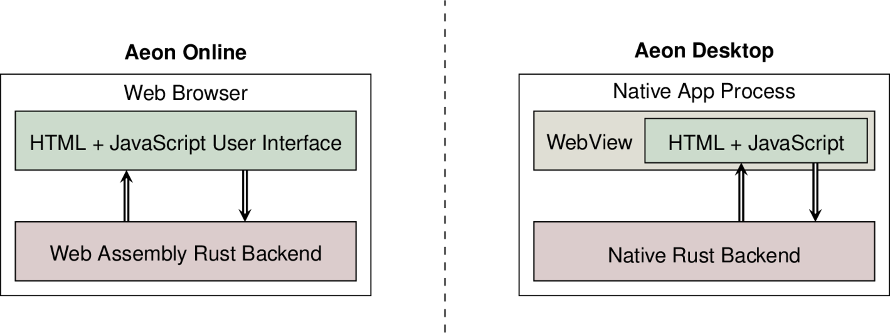

# Aeon/Biodivine General Architecture

As many apps, Aeon is separated into two primary components, *frontend* and *backend*. Since Aeon needs to perform well even on very large models, the backend component is developed using [Rust](https://rustlang.org), which makes it possible to achieve C-like performance while keeping the codebase (relatively) safe. On the frontend, Aeon is built using standard web-based technologies (JavaScript+HTML+CSS), with a slight adjustment: we use [TypeScript](https://www.typescriptlang.org/) as a safer alternative to JavaScript, and [LESS](http://lesscss.org/) as a nicer alternative to CSS.

However, we also want to distribute Aeon both as an online tool and as a desktop application. This brings some architectural challenges that need to be solved. Mainly, this involves combining native Rust applications with JavaScript frontends together with a Rust library built using web assembly.

Here, we mainly look at what dependencies we use in Aeon and how we chose them. For a more detailed look on individual components or development guidelines for either Rust backend or Web frontend, there are separate chapters in this book.

### Rust Backend

Most of Aeon backend is composed of small, single-purpose Rust libraries which are primarily maintained by the *Biodivine* developers. Some are published at `crates.io`, but more experimental features can simply be included as git repositories. There are multiple reasons for doing most of the fundamentals in-house, but they mainly boil down to **(a)** developing custom solutions to custom problems (for example, our BDD library is specifically designed to integrate well into Aeon) **(b)** keeping the toolchain simple (this allows us to guarantee that stuff like web assembly builds will be painless).

> **If you need to use a dependency on a git repo, always use the `revision`, `tag`, or `branch` option to lock the dependency to a particular state of the repository.** For example, `some-dependency = { git = "https://github.com/repo/url.git", tag = "v0.1.0-beta.2" }`. This way, the dependency will survive breaking changes made in the repo. Also, try to avoid transitive git dependencies wherever possible. If they clash, they clash hard and you have to update all of them to matching revisions.

- [biodivine-lib-bdd](https://github.com/sybila/biodivine-lib-bdd) is a small Rust crate that implements the BDD data structure for manipulation of Boolean functions (and, consequently, sets of bit-vectors). It only depends on [fxhash](https://crates.io/crates/fxhash) as a replacement of the default hash function, which is needlessly slow for a use in BDDs.

- [biodivine-lib-param-bn](https://github.com/sybila/biodivine-lib-param-bn) implements everything we currently have for manipulation of (parametrised) Boolean networks. This includes (but is not limited to):

  - `.aeon`/`.sbml`/`.bnet` parsers and serialisers.
  - Symbolic asynchronous state-transition graph of the Boolean network.
  - [Legacy] semi-symbolic asynchronous state-transition graph.
  - Various small quality of life utilities such as detection of SCCs in the network graph, etc.

  As such, this crate depends on [regex](https://crates.io/crates/regex) and [roxmltree](https://crates.io/crates/roxmltree) for parsing, and [bitvector](https://crates.io/crates/bitvector) plus [lazy_static](https://crates.io/crates/lazy_static) for some minor utility features.

- [biodivine-aeon-server](https://github.com/sybila/biodivine-aeon-server) originally contained the bulk of the Aeon backend, back when we used to serve the backend as a HTTP service. Currently, it primarily contains the algorithms used for detection of attractors and stability analysis as well as other compute-intensive features present in Aeon, but it should be gradually dissolved into smaller algorithm-specific repositories that Aeon can depend on directly. At the moment, it depends on many things that are no longer strictly necessary, such as the [rocket http server](https://crates.io/crates/rocket), or [crossbeam](https://crates.io/crates/crossbeam) and [rayon](https://crates.io/crates/rayon) for parallelism. We'd like to keep depending on the [json](https://crates.io/crates/json) crate for serialisation for now though.

- Build automation is handled using [Cargo make](https://github.com/sagiegurari/cargo-make) which puts the whole thing together (the "top level" build tool must be Rust, not JS, because the desktop app is running Rust).

- Finally, [web-view](https://crates.io/crates/web-view) is used by the Aeon desktop app to display the Web frontend as if it was a normal native user interface. We may in the future migrate to something like [tauri](https://github.com/tauri-apps/tauri) which will make the development easier, but at the time of writing, these solutions are not very mature.

  > A note about serialisation and parsers: Neither `json` nor `roxmltree` are particularly *fast* or *type safe* implementations of JSON/XML. However, they support dynamically typed input, which is very important for us when we need to prototype or interact with other dynamically typed languages. If we only needed to serialise-serialisers into XML/JSON, then things like `serde` would be much better. But as it stands right now, we need to have very flexible parsers with very human friendly errors, and automated type-safe serialisation typically does not do that.

### Web Frontend

On frontend, Aeon tries to avoid heavy frameworks, mainly to avoid (developer) lock-in and keep the (forward) compatibility as simple as possible. Therefore, we don't want to rely on a framework that **(a)** may take a long time to learn or **(b)** may break every year-or-so and will require extra dev time to keep updated. A minor **(c)** reason is that Aeon is not particulary UI heavy and most of the interactivity is in the graph editing functionality which has to be mostly custom anyway. Therefore, we are currently using:

- [Parcel.js](https://parceljs.org/) for building the whole website. This includes [TypeScript](https://www.typescriptlang.org/) and [Less](http://lesscss.org/) as a more powerful alternatives to JavaScript/CSS.
- The graph editors are built using [Cytoscape.js](https://js.cytoscape.org/), which is a bit bloated, but works all right for now. We also use some cytoscape extensions for more fancy layouts and better interactivity.
- Finally, for keyboard shortcuts, we use [Hotkeys.js](https://www.npmjs.com/package/hotkeys-js). 
- To use native Aeon functionality in the web browser, the project also contains a Rust library `aeon-wasm` which builds into a web-assembly package that is then used by the Web frontend when native backend is not available.

### 